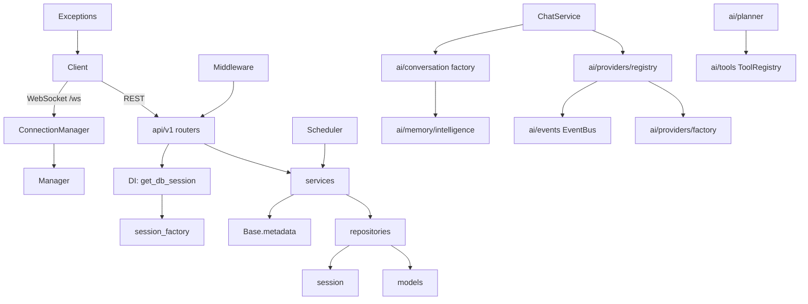

# Architecture

This document describes the internal architecture of the IronmanJARVIS backend:
layering rules, module responsibilities, request lifecycle, and the flows that
run alongside the REST API.

## Layering Rules

Dependencies flow strictly one way, from "outer" HTTP-facing layers inward to
data access. A module may depend on any module to its right, never back:

```
routers  →  services  →  repositories  →  models / session
   ↑           ↑              ↑
dependencies  schemas      (session via DI)
```

- **Routers** must be thin: validate input via Pydantic schemas, call one service,
  map domain errors to HTTP. They never touch the database directly.
- **Services** contain business logic and depend only on repositories and schemas.
- **Repositories** own all SQLAlchemy data access and depend on models.
- **Models** are plain ORM declarations with no logic.
- **Sessions** are provided by dependency injection (`get_db_session`) from the
  app-lifespan-built session factory — services/repositories never construct
  sessions themselves.

## Module Responsibilities

| Module | Responsibility |
|--------|----------------|
| `app/config/settings.py` | Pydantic `Settings` — single source of truth for env / `.env` configuration |
| `app/api/v1/router.py` | Aggregates all routers under the `/api/v1` prefix |
| `app/api/v1/routers/` | One router per resource; HTTP boundary only |
| `app/schemas/` | Pydantic request/response contracts (incl. `ListResponse[T]`) |
| `app/services/` | Domain logic per resource (chat, conversations, notifications, preferences, projects, reminders, settings, system, voice pipeline) |
| `app/repositories/` | `Repository` interface + `SQLAlchemyRepository` implementation |
| `app/database/` | Declarative `Base`, async engine builder, session factory |
| `app/models/` | ORM models, all registered on `Base.metadata` |
| `app/dependencies/` | DI providers (`get_db_session` reads `app.state.session_factory`) |
| `app/exceptions/` | `JARVISError` hierarchy + FastAPI handlers for a uniform error envelope |
| `app/middleware/` | CORS configuration and request logging (`X-Process-Time-Ms` header) |
| `app/websocket/` | `ConnectionManager` (connect/send/broadcast/subscribe) and versioned message envelopes |
| `app/providers/` | Injectable sinks: `MetricsProvider` (psutil snapshot) and `NotificationPublisher` (WebSocket) |
| `app/ai/` | AI layer: providers, conversation engine, tools, planner, memory intelligence, voice, events, skills, plugins, runtime config, performance, observability |
| `app/core/` | Shared constants |
| `app/scheduler/` | Minimal asyncio periodic-task scheduler |
| `app/memory/` | `MemoryManager` — memory CRUD plus `MemoryIntelligence` ranking/consolidation |
| `app/utils/` | Logging helpers, UUID id generation, UTC datetime helpers |

## AI Layer

The AI functionality lives under `app/ai/`, structured provider-agnostically and
local-first. Dependencies flow inward: adapters → registry → conversation engine
→ tools/planner → memory/voice/events → skills/plugins/observability. No module
hardcodes a provider — all reachability is decided by `factory` auto-routing.

```
app/ai/
├── providers/      # provider adapters (ollama, openai-compat, gemini, fallback)
│   ├── base.py     #   AIProvider ABC + Message/Chunk/ProviderReply
│   ├── factory.py  #   build_provider() auto-routing + health gate
│   └── registry.py #   AIManager (retry, auto-fallback, event emission)
├── conversation/   # ConversationManager, ContextBuilder, PromptBuilder,
│                   #   SessionManager, TokenBudget, factory (wires MemoryIntelligence)
├── tools/          # ToolRegistry + 8 built-ins (calculator, datetime, memory,
│                   #   projects, reminders, notifications, web_search, weather)
├── planner/        # planner.py — tool-loop orchestration with keyword fallback
├── memory/         # intelligence.py — embedding-free ranking + consolidation
├── voice/          # STT/TTS/wake-word engines (offline fallbacks), factory
├── events/         # EventBus + typed EventRegistry (chat/ai/planner/voice/memory/system)
├── skills/         # Skill, SkillRegistry, discovery (.md/.yaml frontmatter)
├── plugins/        # Plugin, loader, PluginManager lifecycle
├── config/         # runtime.py — live RuntimeConfig over Settings
├── performance/    # cache.py (AsyncCache), limiter.py (AsyncLimiter)
└── observability/  # metrics.py (AIMetrics), tracing.py (Tracer), factory
```

Chat flow: the REST/WS endpoints call `ChatStreamManager` (in
`app/services/chat_stream_manager.py`), which builds an `AIManager` + conversation
factory per request and streams `chat.started → ai.thinking → chat.chunk* →
chat.end` events over the WebSocket while persisting the assistant message with
latency/tokens.

## Provider Auto-Routing

`build_provider()` in `app/ai/providers/factory.py` resolves the active provider:

1. It reads `Settings.ai_provider` (default `ollama`) and probes the provider's
   health (Ollama: GET `/api/tags`).
2. If the provider is unhealthy and `Settings.ai_auto_fallback` is enabled, it
   falls back through `Settings.ai_fallback_provider` (default `fallback`).
3. The resolved provider + routing decision are exposed on `AIManager` and
   included in chat responses. See [`PROVIDERS.md`](PROVIDERS.md).

## Request Lifecycle

1. A client request arrives and passes through the CORS and request-logging
   middleware.
2. FastAPI matches the path against a router in `app/api/v1/router.py`
   (all under `/api/v1`).
3. FastAPI validates the request against the declared Pydantic schema and query
   params; validation failures raise `RequestValidationError` → `422` envelope.
4. Route dependencies run: `get_db_session` opens an `AsyncSession` from
   `request.app.state.session_factory` (created during app lifespan).
5. The router constructs a service with its repository and awaits the service method.
6. The service executes business logic through the repository, which commits on
   the session.
7. The response model serializes the result; the route returns it. `ListResponse[T]`
   wraps every paged collection as `{ "items": [...], "total": n }`.
8. Domain errors raised anywhere propagate to `register_exception_handlers`,
   which renders the uniform error envelope (see below).

## Dependency Graph



## WebSocket Message Flow

1. A client connects to `/ws`; the endpoint delegates to
   `ConnectionManager.handle()`.
2. `connect()` accepts the socket, registers it in the connection set, and sends
   a `hello` envelope with the active connection count.
3. The receive loop awaits JSON frames. A frame with `"type": "ping"` receives a
   `pong` reply echoing the client `ts` field; all other frames are ignored.
4. On error or disconnect, `disconnect()` removes the client from the set.
5. `broadcast()` fans a JSON envelope out to every connected client; a failing
   client is dropped. `heartbeat`/`broadcast`/`system` types are part of the
   protocol vocabulary (`app/websocket/protocol.py`) and can be sent server-side.

## Scheduler Flow

1. During lifespan startup, `app.main` builds a `Scheduler` and registers the
   `reminder_sweep` task (runs every `REMINDER_SWEEP_INTERVAL_SECONDS`, 60s).
2. `Scheduler.start()` spawns one asyncio task per registered callback.
3. Each runner executes the callback, then sleeps for `interval - elapsed` so
   slow callbacks don't drift (they are skipped rather than overlapped).
4. On shutdown, `Scheduler.stop()` cancels and awaits all runner tasks.

## Error Envelope Contract

Every error response uses the same JSON shape:

```json
{
  "type": "about:blank",
  "title": "Human readable message",
  "status": 404,
  "code": "not_found",
  "detail": null
}
```

| HTTP | `code` | Raised by |
|------|--------|-----------|
| 401 | `unauthorized` | `UnauthorizedError` |
| 403 | `forbidden` | `ForbiddenError` |
| 404 | `not_found` | `NotFoundError` |
| 409 | `conflict` | `ConflictError` |
| 422 | `validation_error` | `ValidationAppError` / Pydantic validation |
| 500 | `internal_error` | `JARVISError` base / unhandled |
| 503 | `service_unavailable` | `ServiceUnavailableError` (e.g. readiness probe) |

## Postgres Migration Note

The data layer is SQLite-first but portable to PostgreSQL: the async engine,
session factory, and Alembic environment are all DSN-driven
(`Settings.database_url`). Column choices (JSON, `String(36)` ids, timezone-aware
`DateTime`) are already portable. See [`POSTGRESQL.md`](POSTGRESQL.md) for the
concrete steps.
